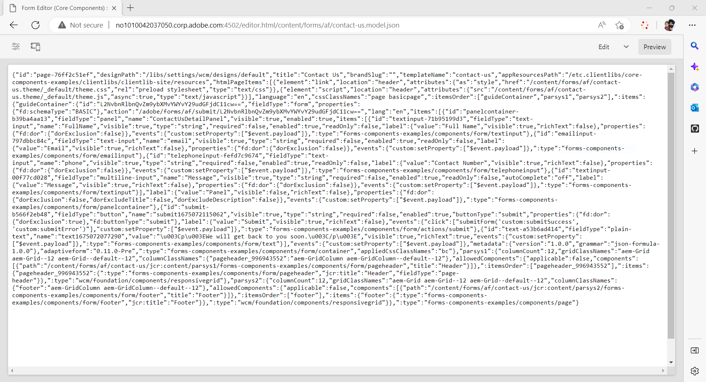

# 使用自适应Forms编辑器创建Headless自适应表单 {#create-a-headless-adaptive-form-using-adaptive-forms-editor}

AEM Formsas a Cloud Service提供了一个用户友好的编辑器，用于创建Headless自适应Forms。 提供了超过24个核心组件，通过在编辑器中拖放组件，可以轻松创建表单。 此外，规则编辑器允许您向表单字段添加验证。

>[!NOTE]
>
> 
>如果您不熟悉Headless自适应Forms，Adobe建议先阅读[使用入门套件创建和发布Headless表单](create-and-publish-a-headless-form.md)教程，了解基础知识并手工制作Headless自适应表单，然后再对Headless表单使用自适应Forms编辑器。

执行以下步骤以使用自适应Forms编辑器创建Headless自适应表单：

## 开始之前：

您需要以下各项才能使用自适应Forms编辑器创建自适应表单：

对于AEM 6.5 Forms：**&#x200B;**

* 访问AEM 6.5.16.0或更高版本Forms创作实例。

* 自适应表单核心组件

* 自适应Forms核心组件模板

* 基于核心组件的模板的自适应表单主题

* 将您的用户添加到[!DNL forms-users]组。 [!DNL forms-users]组的成员有权创建自适应表单。

AEM Forms的&#x200B;**as a Cloud Service：**

* 访问[AEM Formsas a Cloud Service创作实例](https://experienceleague.adobe.com/docs/experience-manager-cloud-service/content/forms/setup-configure-migrate/setup-forms-cloud-service.html?lang=zh-Hans)或[本地AEM Formsas a Cloud ServiceSDK](https://experienceleague.adobe.com/docs/experience-manager-cloud-service/content/forms/setup-configure-migrate/setup-local-development-environment.html?lang=zh-Hans)环境。

* **自适应表单模板**：模板提供基本结构并定义自适应表单的外观（版面和样式）。它的预格式化的组件包含某些属性和内容结构。它还提供用于定义主题和提交操作的选项。主题定义外观，提交操作定义在提交自适应表单时执行的操作。例如，将收集到的数据发送到数据源。Cloud Service 提供一个名为 blank 的 OOTB 模板：

   * `blank Adaptive Forms (Core Components)` 模板包含在每个新的 AEM Forms as a Cloud Service 项目中。
   * 您还可以[从头开始创建新的自适应Forms （核心组件）模板](https://experienceleague.adobe.com/docs/experience-manager-cloud-service/content/forms/adaptive-forms-authoring/authoring-adaptive-forms-foundation-components/create-an-adaptive-form-on-forms-cs/template-editor.html?lang=zh-Hans)。

* **自适应表单主题**：主题包含组件和面板的样式详细信息。样式包括背景颜色、状态颜色、透明度、对齐方式和大小等属性。在应用主题时，指定的样式会反映在相应的组件上。`Canvas` 模板包含在每个新的 AEM Forms as a Cloud Service 项目中。

* **权限**：将用户添加到[!DNL forms-users]组。[!DNL forms-users]组的成员具有创建自适应表单的权限。有关表单特定用户组的详细列表，请参阅[组和权限](https://experienceleague.adobe.com/docs/experience-manager-cloud-service/content/forms/setup-configure-migrate/forms-groups-privileges-tasks.html?lang=zh-Hans)。

## 创建自适应表单  {#create-an-adaptive-form-components}

1. 登录您的[!DNL Experience Manager Forms]创作实例。

1. 在 Experience Manager 登录页面上输入您的凭据。登录后，在左上角，点按 **[!UICONTROL Adobe Experience Manager]** > **[!UICONTROL 表单]** > **[!UICONTROL 表单和文档]**。

1. 点按&#x200B;**[!UICONTROL 创建]** > **[!UICONTROL 自适应表单]**。向导随即打开。在“源”选项卡中，选择一个模板：

   

   选择一个模板时，会自动选择该模板中指定的主题和提交操作，并启用&#x200B;**[!UICONTROL 创建]**&#x200B;按钮。您可以转到&#x200B;**[!UICONTROL 样式]**&#x200B;或&#x200B;**[!UICONTROL 提交]**&#x200B;选项卡以选择不同的主题或提交操作。如果所选模板未指定主题，则“创建”按钮将保持禁用状态。您可以转到&#x200B;**[!UICONTROL 样式]**&#x200B;选项卡以手动选择主题。

1. 在&#x200B;**[!UICONTROL 样式]**&#x200B;选项卡中，选择一个主题：

   * 如果所选模板指定了一个主题，该主题将在向导中自动选定。您还可以从“样式”选项卡中选择其他主题。

   * 如果所选模板未指定主题，您可以使用“样式”选项卡选择主题。**[!UICONTROL 创建]**&#x200B;按钮仅在选择主题后启用。

1. （可选）在“数据”选项卡中，选择一个数据模型：

   * **表单数据模型**：[表单数据模型](https://experienceleague.adobe.com/docs/experience-manager-cloud-service/content/forms/integrate/use-form-data-model/data-integration.html?lang=zh-Hans)可让您将来自不同的数据源的实体和服务集成到自适应表单中。如果您创建的自适应表单需要从多个数据源获取数据和向多个数据源写入数据，请选择表单数据模型。

   * **JSON架构**： [JSON架构](https://experienceleague.adobe.com/docs/experience-manager-cloud-service/content/forms/adaptive-forms-authoring/authoring-adaptive-forms-foundation-components/create-an-adaptive-form-on-forms-cs/adaptive-form-json-schema-form-model.html?lang=zh-Hans)自适应表单允许通过提供关联JSON架构的功能（表示正在生成或使用的数据的结构），与贵组织的后端系统无缝集成。 利用此关联，作者可以使用架构的元素将内容动态添加到自适应表单。在创作过程中，可以在内容浏览器的“数据模型对象”选项卡中轻松访问架构元素，并且所有字段将自动添加到任何新创建的自适应表单中。

   默认情况下，关联的 JSON 架构的所有字段都将自动选定并转换为相应的自适应表单组件，从而简化创作过程。该向导可让您使用复选框选择性地选定应包含在自适应表单中的字段，更加方便。

1. 在&#x200B;**[!UICONTROL 提交]**&#x200B;选项卡中，选择提交操作：

   * 选择一个模板时，该模板中指定的提交操作将自动选定。您可以从“提交”选项卡中选择其他提交操作。**[!UICONTROL 提交]**&#x200B;选项卡显示所有可用的提交操作。

   * 如果所选模板未指定提交操作，您可以使用&#x200B;**[!UICONTROL 提交]**&#x200B;选项卡来选择提交操作

1. （可选）在&#x200B;**[!UICONTROL 交付]**&#x200B;选项卡中，您可以为自适应表单指定发布或取消发布日期。

1. 点按&#x200B;**[!UICONTROL 创建]**。将出现一个对话框，用于指定标题、名称和位置以保存自适应表单：

   * **[!UICONTROL 标题]**：指定表单的显示名称。标题可帮助您在 [!DNL Experience Manager Forms] 用户界面中标识表单。
   * **[!UICONTROL 名称：]**&#x200B;指定表单的名称。在存储库中创建具有指定名称的节点。在开始键入标题时，名称字段的值将自动生成。您可以更改建议的值。名称字段只能包含字母数字字符、连字符和下划线。所有无效的输入都将替换为连字符。
   * **[!UICONTROL 路径：]**&#x200B;指定用于保存自适应表单的位置。您可以直接将自适应表单保存在 `/content/dam/formsanddocuments`，也可以创建一个文件夹（例如 `/content/dam/formsanddocuments/adaptiveforms`）来保存自适应表单。确保先创建文件夹，然后再在路径中使用它。**[!UICONTROL 路径]**&#x200B;字段不会自动创建文件夹。

1. 点按&#x200B;**[!UICONTROL 创建]**。自适应表单将创建并在自适应表单编辑器中打开。该编辑器显示模板中可用的内容。根据自适应表单的类型，关联的 <!--XFA form template, XML schema or --> JSON 架构或表单数据模型显示在边栏的&#x200B;**[!UICONTROL 内容浏览器]**&#x200B;的&#x200B;**[!UICONTROL 数据模型对象]**&#x200B;选项卡中。您还可以拖放这些元素来生成自适应表单。

现在，您可以将自适应Forms组件拖放到自适应Forms容器中来设计和创建表单。

## 查看自适应表单的JSON演绎版 {#preview-form}

选择自适应表单并点按&#x200B;**预览**。 此时会出现窗体预览。 要查看表单的表单定义(JSON)，请使用.model.json替换URL中的.html扩展名

例如，http://[author-server]：[port]/editor.html/content/forms/af/contact-us.model.json

您可以使用Headless自适应Forms [getForm](https://opensource.adobe.com/aem-forms-af-runtime/api/#tag/Get-Form-Definition) API获取表单定义(JSON)并在应用程序中使用它。

