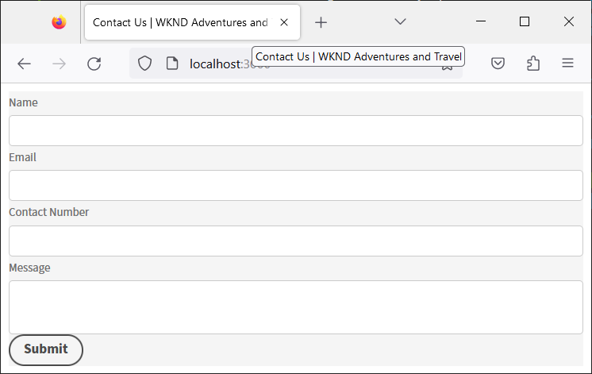

# 使用React应用程序创建和预览Headless表单 {#introduction}

<!-- Missing image ALT image tags -->

入门套件可帮助您快速入门，使用React应用程序。 您可以在自己选择的Angular、Vanilla JS和其他开发环境中自由开发和使用Headless自适应表单。

从Headless自适应表单开始使用非常简单快捷。 克隆现成的React项目，安装依赖项，然后运行该项目。 您已将一个Headless自适应表单集成在React应用程序中并正在运行。 您可以在将Headless自适应表单部署到生产环境之前，使用示例react项目来构建和测试该表单。

让我们开始吧：

>[!NOTE]
>
>
> 本快速入门指南使用React应用程序。 您可以自由使用所选的技术或编程语言来使用Headless自适应表单。

## 开始之前 {#pre-requisites}

要创建并运行React应用程序，您应在计算机上安装以下组件：

* 安装[最新版本的Git](https://git-scm.com/downloads)。 如果您是初次使用Git，请参阅[安装Git](https://git-scm.com/book/en/v2/Getting-Started-Installing-Git)。

* 安装[Node.js 16.13.0或更高版本](https://nodejs.org/en/download/)。<!-- URL is 404!! If you are new to Node.js, see [How to install Node.js](https://nodejs.dev/en/learn/how-to-install-nodejs). -->

## 开始使用

满足要求后，请执行以下步骤以开始：

1. [设置Headless自适应表单入门工具包](#setup)

1. [预览入门套件中包含的Headless自适应表单](#preview)

1. [创建和渲染您自己的Headless自适应表单](#custom)


## 1.设置Headless自适应表单入门工具包 {#install}

入门套件是一个React应用程序，其中包含示例Headless自适应表单和相应的库。 使用该套件开发和测试Headless自适应表单和相应的React组件。 运行以下命令以设置Headless自适应表单入门工具包：

1. 打开命令提示符并运行以下命令：

   ```shell
   git clone https://github.com/adobe/react-starter-kit-aem-headless-forms
   ```

   该命令在当前位置创建一个名为&#x200B;**react-starter-kit-aem-headless-forms**&#x200B;的目录，并将Headless自适应表单React入门应用程序克隆到该目录中。 除了呈现表单所需的配置和依赖项列表之外，该目录还包含以下重要内容：

   * **示例表单**：入门套件包含示例贷款申请表。 要查看应用程序包含的表单（表单定义），请打开`/react-starter-kit-aem-headless-forms/form-definations/form-model.json`文件。
   * **示例React组件**：入门套件包括RTF和Slider的示例react组件。 本指南可帮助您使用这些富文本和滑块组件创建自己的自定义组件。
   * **Mappings.ts**： mappings.ts文件可帮助您将自定义组件映射到表单字段。 例如，将数值步进器字段映射到评级组件。
   * **环境配置**：环境配置允许您选择呈现入门套件中包含的表单或从AEM Forms服务器获取表单。

   

   >[!NOTE]
   >
   > 
   > 文档中的示例基于VSCode。 您可以随意使用任何纯文本代码编辑器。


1. 导航到&#x200B;**react-starter-kit-aem-headless-forms**&#x200B;目录并运行以下命令以安装依赖项：

   ```shell
   npm install
   ```

   该命令会下载构建和运行应用程序所需的每个包和库，包括Headless自适应表单库(@aemforms/af-react-renderer、@aemforms/af-react-components、@adobe/react-spectrum)。 然后，它运行验证并保留每个表单实例的数据。


   


## 2.预览Headless自适应表单 {#preview}

设置入门套件后，您可以预览示例Headless自适应表单，并将其替换为您自己的自定义表单。 您还可以配置入门工具包，以从AEM Forms服务器中检索表单。 预览表单

1. 将`env_template`文件重命名为`.env`文件。 此外，还要确保USE_LOCAL_JSON选项设置为true。

   

   <!-- The options in the .env file help you configure source of the forms definantion (.JSON):
    *  To source forms definantion (.JSON) from an AEM Server, set USE_LOCAL_JSON option to false, use the AEM_URL option to specify URL  of your AEM Server, and set the AEM_FORM_PATH option to path of your adaptive form.
    *  To source forms definantion (.JSON) form-model.json file included in the starter-kit, set USE_LOCAL_JSON option to false. -->

1. 使用以下命令运行应用程序：

   ```shell
     npm start
   ```


   此命令启动本地开发服务器，并在默认Web浏览器中打开启动应用程序中包含的示例Headless自适应表单。

   

   准备好了！ 您已准备好开始开发自定义Headless自适应表单。

   <!--  As you know, in a headless form the form data and logic are separate from the presentation layer and can be used by any client that can make HTTP requests, such as a mobile app, a static site, or a different web application. The form is often managed and stored on a server, which serves as the backend for the form. The client sends requests to the server to retrieve the form, submit data, and receive updated form data. This allows for greater flexibility and integration with different technologies. You can store and retrive a Headless Adaptive form on an AEM Server  -->

## 3.创建和渲染您自己的Headless自适应表单{#custom}

Headless自适应表单以JSON(JavaScript对象表示法)格式表示表单及其组件，例如字段和按钮。 使用JSON格式的优点在于它易于被各种编程语言解析和使用，使其成为系统之间交换表单数据的便利方式。 要查看应用程序中包含的Headless自适应表单示例，请打开`/react-starter-kit-aem-headless-forms/form-definations/form-model.json`文件。

让我们创建一个`Contact Us`表单，其中包含四个字段：“姓名”、“电子邮件”、“联系电话”和“消息”。 这些字段被定义为JSON中的对象（项目），每个对象（项目）均具有类型、标签、名称和必填等属性。 该表单还包含“提交”类型的按钮。 以下是表单的JSON。


```JSON
{
  "afModelDefinition": {
    "adaptiveform": "0.10.0",
    "items": [
      {
        "fieldType": "text-input",
        "label": {
          "value": "Name"
        },
        "name": "name"
      },
      {
        "fieldType": "text-input",
        "format": "email",
        "label": {
          "value": "Email"
        },
        "name": "email"
      },
      {
        "fieldType": "text-input",
        "format": "phone",
        "pattern": "[0-9]{10}",
        "label": {
          "value": "Contact Number"
        },
        "name": "Phone"
      },
      {
        "fieldType": "multiline-input",
        "label": {
          "value":"Message"
        },
        "name": "message"
      },
      {
        "fieldType": "button",
        "label":{
          "value": "Submit"
        },
        "name":"submit",
        "events":{
          "click": "submitForm()"
        }
      }
    ],
    "action": "https://eozrmb1rwsmofct.m.pipedream.net",
    "description": "Contact Us",
    "title": "Contact Us",
    "metadata": {
      "grammar": "json-formula-1.0.0",
      "version": "1.0.0"
    }
  }
}
```

>[!NOTE]
>
> * 仅React应用程序需要“afModelDefinition”属性，该属性不是表单定义的一部分。
> * 您可以手工创建表单JSON或使用[AEM自适应表单编辑器(自适应表单WYSIWYG编辑器)](create-a-headless-adaptive-form.md)创建和投放表单JSON。 在生产环境中，您可以使用AEM Forms来交付表单JSON，稍后将对此进行详细介绍。
> * 本教程使用https://pipedream.com/来测试表单提交。 使用您自己的端点或组织批准的第三方端点从Headless自适应表单接收数据。


要渲染表单，请将示例Headless自适应表单JSON `/react-starter-kit-aem-headless-forms/form-definations/form-model.json`替换为上述JSON，保存文件，等待启动套件编译并刷新表单。


<!-- Your form is ready. Let's add some validations and make "Name", "Email", and "Message" fields mandatory. -->

您已成功渲染Headless自适应表单。


## 奖励

让我们将托管表单的网页的标题设置为`Contact Us | WKND Adventures and Travel`。 要更改标题，请打开&#x200B;_react-starter-kit-aem-headless-forms/public/index.html_&#x200B;文件进行编辑并设置标题。




## 下一步

默认情况下，入门套件使用[Adobe的Spectrum](https://spectrum.adobe.com/)组件呈现表单。 您可以创建并使用自己的组件或第三方组件。 例如，使用Google Material UI或Chakra UI。

我们[使用Google材料UI](use-google-material-ui-react-components-to-render-a-headless-form.md)来渲染`Contact Us`表单。


