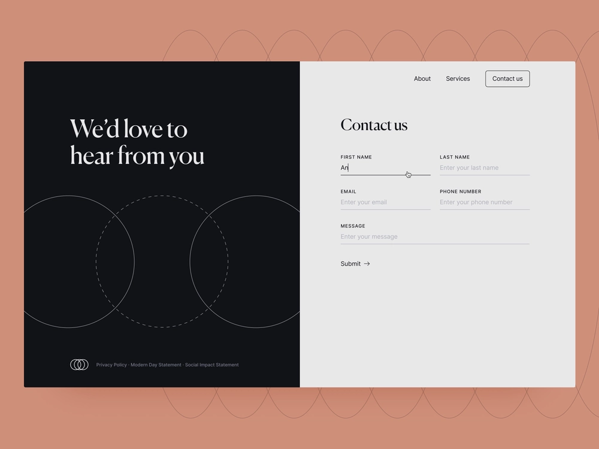

# Headless自适应Forms快速入门

本教程提供了一个用于创建Headless自适应表单的端到端框架。 本教程将组织为一个用例和多份指南。 每个指南都可帮助您学习并将新功能添加到本教程中创建的Headless自适应表单中。 每份指南后，您都会拥有一个有效的Headless自适应表单。 在本教程结束时，您应该能够执行以下操作：

* 创建Headless自适应表单
* 将业务规则添加到表单
* 使用Google材料UI设置表单样式
* 预填您的表单
* 将表单嵌入到网页

您还将了解Headless自适应表单的架构、可用工件和JSON结构。

**历程从学习用例开始**：

拉亚·谭是一个以自然美景和旅游经济繁荣而闻名的国家的外交部成员，负责向游客分发签证表格。 这些表单可在旅游部的网站、本机移动应用程序上获取，并以PDF格式提供，旅游者可以选择多种语言。 但是，在不同平台和技术中管理和扩展这些表单可能具有挑战性。

为了提高签证申请流程的效率和灵活性，外交部决定采用Headless自适应表单方法。 这种分离式架构将前端与后端分离，允许更大的定制和可扩展性。 部门计划使用Google材料UI的React组件来增强表单的用户体验。 此外，它还将使用后端功能，例如：

* 数字签名
* 数据集成
* 业务流程管理
* 记录文档
* 使用情况分析

游客最常使用的表格是“联系我们”表格，用于询问各种问题。 因此，外交部已选择开始使用此表单实施Headless自适应表单方法。 本教程将指导您使用此新架构完成创建“联系我们”表单的过程。 最终结果如下所示：

