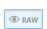
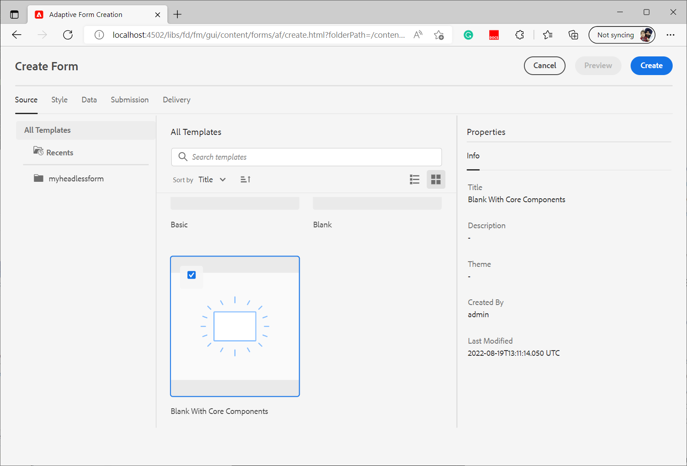

# 创建您的第一个Headless自适应表单

您可以使用Adobe Experience Manager Headless自适应表单通过前端UI（如React）构建表单应用程序，并使用Forms Web SDK实现状态管理、验证和与其他各种接触点集成等功能。

例如，一家组织We.Org希望将其客户注册历程数字化。 他们的开发人员精通使用Angular构建前端解决方案。 他们希望构建自定义前端，同时将表单验证和电子签名卸载到专用解决方案。

Adobe Experience Manager Headless自适应表单让此类组织能够自由使用其在前端语言中的现有专业知识构建表单，同时支持使用后端功能创建企业级表单体验。

<!-- >>[!VIDEO](https://video.tv.adobe.com/v/341011/) -->

<!--   -->

## 开始之前

* 设置[开发环境](setup-development-environment.md)以允许您在本地计算机上创建和测试Headless自适应表单。
* 以下软件必须安装在本地开发计算机上：
   * [Java开发工具包11](https://experience.adobe.com/#/downloads/content/software-distribution/en/general.html?1_group.propertyvalues.property=.%2Fjcr%3Acontent%2Fmetadata%2Fdc%3AsoftwareType&amp;1_group.propertyvalues.operation=equals&amp;1_group.propertyvalues.0_values=software-type%3Atooling&amp;fulltext=Oracle%7E+JDK%7E+11%7E&amp;orderby=%40jcr%3Acontent%2Fjcr%3AlastModified&amp;orderby.sort=desc&amp;layout=list&amp;p=list&amp;p.offset=limit&amp;p.offset=0&amp;p.limit=14444)
   * [最新版本的Git](https://git-scm.com/downloads)。 如果您是初次使用Git，请参阅[安装Git](https://git-scm.com/book/en/v2/Getting-Started-Installing-Git)。
   * [Node.js 16.13.0或更高版本](https://nodejs.org/en/download/)。 如果您是初次使用Node.js，请参阅[如何安装Node.js](https://nodejs.dev/en/learn/how-to-install-nodejs)。
   * [Maven 3.6或更高版本](https://maven.apache.org/download.cgi)。 如果您不熟悉Maven，请参阅[安装Apache Maven](https://maven.apache.org/install.html)。


## 使用原型项目创建Headless自适应表单

原型项目是一个基于maven的模板。 它根据最佳实践创建一个最小的项目来开始使用Headless自适应表单。 它还包含用于Formsas a Cloud Service和本地开发环境的Headless自适应表单功能。 在测试版阶段，必须创建和部署基于37原型或更高版本的项目。 Post-beta仅需要进行自定义才能使用该项目。

执行以下步骤创建和渲染首个Headless自适应表单：

1. [创建和部署基于AEM原型的项目](#create-an-archetype-based-project)
1. [将项目部署到AEM SDK](#deploy-the-project-to-a-local-development-environment)
1. [创建Headless自适应表单的JSON架构并将其上传到您的AEM SDK实例](#create-add-json-representation-of-headless-adaptive-forms)
1. [基于带核心组件的空白模板创建自适应表单](#create-adaptive-form-with-blank-with-core-components-template)


### 1.创建和部署基于AEM原型的项目 {#create-an-archetype-based-project}

根据操作系统，运行以下命令以创建Experience Manager Formsas a Cloud Service项目。 使用原型版本37或更高版本。 请参阅[Archetype文档](https://experienceleague.adobe.com/docs/experience-manager-core-components/using/developing/archetype/overview.html)以查找最新版本的Archetype。

**Microsoft Windows**

1. 以管理员权限打开命令提示符（以管理员身份运行命令提示符或bash shell）
1. 运行以下命令：

   ```shell
     mvn -B org.apache.maven.plugins:maven-archetype-plugin:3.2.1:generate ^
     -D archetypeGroupId=com.adobe.aem ^
     -D archetypeArtifactId=aem-project-archetype ^
     -D archetypeVersion=37 ^
     -D appTitle=myheadlessform ^
     -D appId=myheadlessform ^
     -D groupId=com.myheadlessform ^
     -D includeFormsenrollment="y" ^
     -D includeFormsheadless="y" 
   ```

   * 设置`appTitle`以定义标题和组件组。
   * 设置`appId`以定义Maven artifactId、组件、配置和内容文件夹名称以及客户端库名称。
   * 设置`groupId`以定义Maven groupId和Java Source包。
   * 使用`includeFormsenrollment=y`选项可包含创建自适应Forms所需的特定于Forms的配置、主题、模板、核心组件和依赖项。
   * 使用`includeFormsheadless=y`选项包含Forms核心组件和包含Headless自适应Forms功能所需的依赖项。 启用此选项时，包括以下内容：
      * 带核心组件的&#x200B;**空白**&#x200B;模板带[核心组件](https://experienceleague.adobe.com/docs/experience-manager-core-components/using/introduction.html?lang=zh-Hans)。
      * 前端React模块`ui.frontend.react.forms.af`。 它可帮助您在react应用程序中渲染Headless自适应表单。


**Apple macOS或Linux**：

1. 以root用户身份打开终端。 它允许您以管理权限运行命令。 在打开终端窗口后，您还可以使用`sudo root`命令以管理权限运行命令。
1. 运行以下命令：

   ```shell
     mvn -B org.apache.maven.plugins:maven-archetype-plugin:3.2.1:generate \
     -D archetypeGroupId=com.adobe.aem \
     -D archetypeArtifactId=aem-project-archetype \
     -D archetypeVersion=37 \
     -D appTitle=myheadlessform \
     -D appId=myheadlessform \
     -D groupId=com.myheadlessform \
     -D includeFormsenrollment="y" \
     -D includeFormsheadless="y"  
   ```

   * 设置`appTitle`以定义标题和组件组。
   * 设置`appId`以定义Maven artifactId、组件、配置、内容文件夹名称和客户端库名称。
   * 设置`groupId`以定义Maven groupId和Java Source包。
   * 使用`includeFormsenrollment=y`选项可包含创建自适应Forms所需的特定于Forms的配置、主题、模板、核心组件和依赖项。
   * 使用`includeFormsheadless=y`选项包含Forms核心组件和包含Headless自适应Forms功能所需的依赖项。 启用此选项时，包括以下内容：
      * 带核心组件的&#x200B;**空白**&#x200B;模板带[核心组件](https://experienceleague.adobe.com/docs/experience-manager-core-components/using/introduction.html?lang=zh-Hans)。
      * 前端反应模块`ui.frontend.react.forms.af`。 它可帮助您在react应用程序中渲染Headless自适应表单。

成功完成该命令后，将创建在`appID`中指定的名称的项目文件夹。 例如，如果您使用值为`myheadlessform`的`appID`，则会创建名为`myheadlessform`的文件夹。 它包含基于原型的项目。


### 2.将项目部署到AEM SDK {#deploy-the-project-to-a-local-development-environment}

当您将项目部署到AEM SDK实例时，它会将Headless自适应Forms功能、**带核心组件的“空白”**&#x200B;模板以及项目中包含的其他资源添加到开发环境。 <!-- Deploy the project to your local development environment to locally create Headless Adaptive Forms. or deploy directly to your Forms as a Cloud Service environment. !-->要部署到AEM SDK实例，请执行以下操作：

1. 打开命令提示符。 如果您在Windows上，请使用管理员权限（运行命令提示符或以管理员身份运行[Git bash shell](https://khushwantsehgal.wordpress.com/2022/06/29/check-if-git-bash-is-running-in-administrator-mode/)）打开命令提示符。

1. 导航到在上一步中创建的项目目录。 例如，`/myheadlessform`

   

1. 运行以下命令：

   ```shell
   mvn -PautoInstallPackage clean install
   ```

   等待“BUILD SUCCESS”消息。
   已成功部署

   解决依赖项和部署项目可能需要很长时间。 如果部署项目失败，请参阅[疑难解答](troubleshooting.md)文章以了解常见问题及其解决方法。


<!-- *  To learn how to deploy code to AEM as a Cloud Service, see the video in [Deploying to AEM as a Cloud Service]https://experienceleague.adobe.com/docs/experience-manager-cloud-service/content/implementing/deploying/overview.html?lang=en#coding-against-the-right-aem-version) article : -->


### 3.创建Headless自适应表单的JSON架构，并将其上传到您的AEM SDK实例 {#create-add-json-representation-of-headless-adaptive-forms}

Headless自适应Forms表示为JSON文件。 您可以从[Storybook](https://opensource.adobe.com/aem-forms-af-runtime/storybook/?path=/story/reference-examples--contact)中获取示例表单，或者使用位于`[Archetype Project]\ui.content\src\main\content\jcr_root\content\dam\myheadlessform\af_model_sample.json`的Archetype项目中的示例表单include。 此文档使用Storybook中的[简介](https://opensource.adobe.com/aem-forms-af-runtime/storybook/?path=/story/reference-examples--introduction)表单。 它是一个字段表单，可帮助您快速开始使用Headless自适应Forms。<!-- The [specifications](/help/assets/Headless-Adaptive-Form-Specification.pdf) document provides detailed information about various components, rules, and constraints for Headless Adaptive Forms -->

创建和上传架构：

1. 创建扩展名为`.json`的纯文本文件。 例如，`myfirstform.json`。您可以在文件系统上的任何位置或在基于AEM Archetype的项目中于`\<project-name>\ui.content\src\main\content\jcr_root\content\dam\myheadlessform\<formname>.json`创建文件
1. 将以下JSON内容添加到您的`.json`文件并保存：

   ```JSON
   {
     "adaptiveform": "0.10.0",
     "items": [
       {
         "fieldType": "text-input",
         "label": {
           "value": "Enter your Name"
         },
         "name": "textInput"
       }
     ],
     "metadata": {
       "grammar": "json-formula-1.0.0",
       "version": "1.0.0"
     }
   }
   ```

   它向表单中添加一个字段：

   

1. 登录到您的[本地AEM SDK实例](setup-development-environment.md#setup-author-instance)
1. 导航到Adobe Experience Manager > Forms > Forms和文档。 点按创建>文件上传。
1. 选择在步骤2中创建的`.json`并将其上传。 您已准备好创建Headless自适应表单。 如果您将.json文件保存到位于`\<project-name>\ui.content\src\main\content\jcr_root\content\dam\myheadlessform\<formname>.json`的基于AEM原型的项目中。 您可以使用`mvn -PautoInstallPackage clean install`将项目部署到AEM SDK，并同时使用`<formname>.json`。

如果上传`.json`失败，请确保已成功部署[AEM Archetype项目](#deploy-the-project-to-a-local-development-environment)。

<!-- 1. Open the [contact form](https://opensource.adobe.com/aem-forms-af-runtime/storybook/?path=/story/reference-examples--contact) and tap the [](faq.md#storybook-example) icon on bottom-right side of the Storybook page to view the source code of the headless . 

You can use [Adaptive Forms builder extension for Visual Studio Code](/help/setup-development-environment.md#microsot-visual-studio-code-extension-for-headless-adaptive-forms) to build a JSON schema of your Headless Adaptive Forms. 

You can see [Storybook](https://opensource.adobe.com/aem-forms-af-runtime/storybook/?path=/story/reference-examples--introduction) for sample JSON schemas and list of components, attributes, and properties. You can also see the [specifications document](/help/assets/Headless-Adaptive-Form-Specification.pdf) for detailed information on all the components, constraints, and methods available to define Headless Adaptive Forms.

File extension of a JSON schema of Headless Adaptive Forms is .json. For example, formname.json. Create or add the file to your AEM Archetype based project. For example, `\myheadlessform\ui.content\src\main\content\jcr_root\content\dam\myheadlessform\home-loan.json` -> 

### 3. Deploy the project to a local development environment {#deploy-the-project-to-a-local-development-environment}

You can deploy the project to local development environment. It adds Headless Adaptive Forms functionality, the **Blank with core components** template, JSON schema of form, and other resources included in the project to your development environment. <!-- Deploy the project to your local development environment to locally create Headless Adaptive Forms. or deploy directly to your Forms as a Cloud Service environment. To deploy to your local development environment, use the following command: 

    `mvn -PautoInstallPackage clean install`

If you are on Windows, run the above with Administrative privileges (Run command prompt or [bash shell as an administrator](https://khushwantsehgal.wordpress.com/2022/06/29/check-if-git-bash-is-running-in-administrator-mode/)). For the complete list of commands, see [Building and Installing](https://experienceleague.adobe.com/docs/experience-manager-core-components/using/developing/archetype/using.html?lang=en#building-and-installing).
    
<!-- *  To learn how to deploy code to AEM as a Cloud Service, see the video in [Deploying to AEM as a Cloud Service]https://experienceleague.adobe.com/docs/experience-manager-cloud-service/content/implementing/deploying/overview.html?lang=en#coding-against-the-right-aem-version) article : -->

### 4.基于带有核心组件的空白模板创建自适应表单 {#create-adaptive-form-with-blank-with-core-components-template}

1. 登录到您的[AEM SDK实例](http://localhost:4502/)。

1. 导航到Adobe Experience Manager > Forms > Forms和文档。

1. 点按创建，然后选择自适应表单。 选择&#x200B;**Blank with core components**&#x200B;模板，然后点按创建。

   

1. 指定以下属性字段的值。 标题和名称字段是必填字段：

   * **标题**：指定表单的显示名称。 标题可帮助您在Experience Manager Forms用户界面中识别表单。
   * **名称**：指定表单的名称。 在存储库中创建具有指定名称的节点。在开始键入标题时，名称字段的值将自动生成。您可以更改建议的值。名称字段只能包含字母数字字符、连字符和下划线。所有无效的输入都将替换为连字符。

1. 点按创建。 创建自适应表单。

如果您没有看到&#x200B;**Blank with core components**&#x200B;模板，请确保已成功部署[AEM Archetype项目](#deploy-the-project-to-a-local-development-environment)。

### 5.配置自适应表单以使用JSON架构 {#configure-adaptive-form-to-use-the-JSON-representation}

上一步中创建的自适应表单为空白。 配置自适应表单以使用JSON架构：

1. 登录到您的[AEM SDK实例](http://localhost:4502/)。

1. 导航到Adobe Experience Manager > Forms > Forms和文档。 选择在上一步中创建的自适应表单，然后点按编辑。 自适应表单将在编辑器中打开。

1. 点按自适应Forms容器组件，然后点按属性。 它会在侧栏中显示属性资源管理器。

1. 在属性资源管理器中，展开BASIC折叠面板，并指定在上一步中为Forms运行时文档路径选项上传的JSON架构的路径。 容器组件显示表单的演绎版。

1. 在属性资源管理器中，展开“提交”折叠面板，并为自适应表单设置“提交操作” 。 您的表单已准备好在react应用程序中使用。

1. 要呈现表单，请在本地开发计算机上托管：

   1. 打开`[Archetype project]\ui.frontend.react.forms.af\.env`文件并设置表单路径。 例如，/content/forms/af/contact

   1. 打开命令提示符并导航到ui.frontend.react.forms.af项目，然后运行以下命令：

      `npm run start`

   1. 完成后，在浏览器窗口中打开localhost：3000以查看渲染的Headless自适应表单。
   1. 要测试提交功能，请登录到AEM Forms服务器，然后使用&#x200B;**在HTML中预览表单**&#x200B;选项在预览模式下打开表单。

[Storybook](https://opensource.adobe.com/aem-forms-af-runtime/storybook/)提供了可以在各种Headless自适应Forms上设置的组件和规则列表，以及Headless自适应Forms的JSON架构的一些示例。 您还可以查看[规范](/help/assets/Headless-Adaptive-Form-Specification.pdf)文档，了解与Headless自适应Forms相关的各种规则和属性。
