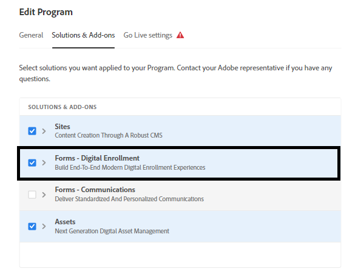

# 在Cloud Service上设置Headless自适应表单的开发环境

<span class="preview"> 这是 **工作进行中** 文章。</span>


准备好在Cloud Service上构建和测试Headless自适应表单了吗？ 为您的Cloud Service计划启用Forms并开始。

## 开始之前

* 安装 [最新版本的Git](https://git-scm.com/downloads) 在本地计算机上。 如果您不熟悉Git，请参阅 [安装Git](https://git-scm.com/book/en/v2/Getting-Started-Installing-Git). 您可以使用Git存储库将在本地开发环境中开发的表单和自定义代码推送到Cloud Service开发环境。

* 安装 [Node.js 16.13.0或更高版本](https://nodejs.org/en/download/) 在本地计算机上。 如果您是初次使用Node.js，请参阅 [如何安装节点.js](https://nodejs.dev/en/learn/how-to-install-nodejs).

* 创建AEMas a Cloud Service程序：遵循的步骤1-7 [创建项目](https://experienceleague.adobe.com/docs/experience-manager-cloud-service/content/onboarding/demo-add-on/create-program.html?#create-program) 文章，为您的组织创建项目。

* 启用 [您的Cloud Service计划的预发行渠道](https://experienceleague.adobe.com/docs/experience-manager-cloud-service/content/release-notes/prerelease.html?cloud-environments).

## 设置工作流

要在Formsas a Cloud Service沙盒上启用Headless自适应表单，请启用 `Forms - Digital enrolment` 解决方案，在本地计算机上创建一个基于Archetype 37或更高版本的AEM Cloud Service项目，并将其推送到您的Formsas a Cloud Service环境中。 完整的过程是：


### 1.为您的项目启用Forms

<table style="table-layout:auto">
<tr>
  <td>
  1.登录 <a href="https://experience.adobe.com/" > https://experience.adobe.com/ </a>  并选择 <b> Experience Manager </b> 选项。
  </td>
  <td>
    <a href="https://experienceleague.adobe.com/docs/experience-manager-cloud-service/content/onboarding/demo-add-on/create-program.html?#create-program">
      
    </a>
    <br>
  </td>
</tr>
<tr>
  <td>
  2.对于 <b> Cloud Manager </b> 选项，单击 <b> 启动。 </b> 此时将显示您所在组织的项目列表。
  </td>
  <td>
    <a href="https://experienceleague.adobe.com/docs/experience-manager-cloud-service/content/onboarding/demo-add-on/create-program.html?#create-program">
      
    </a>
    <br>
  </td>
</tr>
<tr>
  <td>
    3.对于您的项目，点按……图标，然后选择 <b> 编辑项目 </b> 选项。 将显示一个对话框。 
  </td>
  <td>
    <a href="https://experienceleague.adobe.com/docs/experience-manager-cloud-service/content/onboarding/demo-add-on/create-program.html?#create-program">
      
    </a>
    <br>
  </td>
</tr>
<tr>
  <td>
    4.在“编辑程序”对话框中，转到 <b> “解决方案和插件”选项卡 </b>，选择 <b> Forms — 数字注册 </b> 选项，然后点击 <b> 更新 </b>. 
  </td>
  <td>
    <a href="https://experienceleague.adobe.com/docs/experience-manager-cloud-service/content/onboarding/demo-add-on/create-program.html?#create-program">
      
    </a>
    <br>
  </td>
</tr>
</table>

### 2.将程序的Git存储库克隆到本地计算机

每个AEMas a Cloud Service程序都有一个Git存储库。 它允许您将自定义代码和资源从本地计算机上传到Cloud Service环境。 在设置过程中，我们使用Git存储库将Headless自适应表单相关代码、模板和其他信息从本地计算机引入您的Cloud Service程序。 在本地计算机上克隆Cloud ServiceGit存储库是将自定义代码和内容从本地计算机引入Cloud Service的第一步。

>[!INFO]
>
> 您始终可以提交到Git存储库而不对其进行克隆。 但是，它也有自己的怪癖。 因此，我们在此文档中使用了克隆方法。


要克隆存储库：

<table style="table-layout:fixed">
<tr>
  <td>
  1.在项目的管道框中，点击 <b> 访问存储库信息。 </b> 此时将显示一个包含存储库信息的对话框 
  </td>
  <td>
    <a href="https://experienceleague.adobe.com/docs/experience-manager-cloud-service/content/onboarding/demo-add-on/create-program.html?#create-program">
      
    </a>
    <br>
  </td>
</tr>
<tr>
  <td>
  2.点击 <b> 生成密码 </b> 并复制 <b> 存储库URL。 </b> 
  </td>
  <td>
      
    <br>
  </td>
</tr>
<tr>
  <td>
    3.在本地计算机上，打开命令提示符，创建一个文件夹，然后运行以下命令，并提供系统信息库凭据（已询问）：
    </br>
    <code> git clone [Repository URL] </code> </br></br>
    例如， </br> 
    <code> git clone https://git.cloudmanager.adobe.com/stage-aemformsdev/khushwantsingh-p45413-uk89613/ </code>

</br> 如果系统询问您，请获取 <b> 用户名</b> 和 <b>密码</b> 从 <b>存储库信息</b> 屏幕。
</td>
  <td>
     
  </td>
</tr>
</table>


### 3.创建基于AEM原型的项目

原型项目是一个基于maven的模板。 它根据最佳实践创建一个最小的项目来开始使用Headless自适应表单。 它还包含用于Formsas a Cloud Service的核心Headless自适应表单功能。 必须创建和部署基于37或更高版本的原型项目。
®®？根据操作系统，运行maven命令以创建Experience Manager Formsas a Cloud Service项目。 使用原型版本37或更高版本。 请参阅 [原型文档](https://experienceleague.adobe.com/docs/experience-manager-core-components/using/developing/archetype/overview.html) 以查找最新版本的Archetype。

+++ Microsoft® Windows

1. 使用管理权限（以管理员身份运行命令提示符或bash shell ）打开命令提示符。
1. 运行以下命令：

   ```shell
     mvn -B org.apache.maven.plugins:maven-archetype-plugin:3.2.1:generate ^
     -D archetypeGroupId=com.adobe.aem ^
     -D archetypeArtifactId=aem-project-archetype ^
     -D archetypeVersion=37 ^
     -D appTitle=myheadlessform ^
     -D appId=myheadlessform ^
     -D groupId=com.myheadlessform ^
     -D includeFormsenrollment="y" ^
     -D includeFormsheadless="y" 
   ```

™™™ *设置 `appTitle` 以定义标题和组件组。
*设置 `appId` 定义Maven artifactId、组件、配置和内容文件夹名称以及客户端库名称。
*设置 `groupId` 定义Maven groupId和Java™源包。
*使用 `includeFormsenrollment=y` 选项以包括创建自适应Forms所需的Forms特定配置、主题、模板、核心组件和依赖项。
*使用 `includeFormsheadless=y` 选项以包含Forms核心组件以及包含Headless自适应表单功能所需的依赖项。 启用此选项时，包括以下内容：\
*此 **带核心组件的空白** 模板 [核心组件](https://experienceleague.adobe.com/docs/experience-manager-core-components/using/introduction.html?lang=zh-Hans).
*前端React模块， `ui.frontend.react.forms.af`. 它可帮助您在react应用程序中渲染Headless自适应表单。

+++®®？


+++ Apple macOS或Linux®

1. 以root用户身份打开终端。 它允许您以管理权限运行命令。 您还可以使用 `sudo root` 命令，以使用管理权限运行命令。
1. 运行以下命令：

   ```shell
     mvn -B org.apache.maven.plugins:maven-archetype-plugin:3.2.1:generate \
     -D archetypeGroupId=com.adobe.aem \
     -D archetypeArtifactId=aem-project-archetype \
     -D archetypeVersion=37 \
     -D appTitle=myheadlessform \
     -D appId=myheadlessform \
     -D groupId=com.myheadlessform \
     -D includeFormsenrollment="y" \
     -D includeFormsheadless="y"  
   ```

™™™ *设置 `appTitle` 以定义标题和组件组。
*设置 `appId` 定义Maven artifactId、组件、配置、内容文件夹名称和客户端库名称。
*设置 `groupId` 定义Maven groupId和Java™源包。
*使用 `includeFormsenrollment=y` 选项以包括创建自适应Forms所需的Forms特定配置、主题、模板、核心组件和依赖项。
*使用 `includeFormsheadless=y` 选项以包含Forms核心组件以及包含Headless自适应表单功能所需的依赖项。 启用此选项时，包括以下内容：\
*此 **带核心组件的空白** 模板 [核心组件](https://experienceleague.adobe.com/docs/experience-manager-core-components/using/introduction.html?lang=zh-Hans).
*前端反应模块， `ui.frontend.react.forms.af`. 它可帮助您在react应用程序中渲染Headless自适应表单。

+++

成功完成该命令后，将使用 `appID` 创建。 例如，如果您使用 `appID` 具有值 `myheadlessform`，一个名为的文件夹 `myheadlessform` 创建。 它包含基于原型的项目。

### 4.将基于AEM原型的项目推送到Cloud Service环境

1. 将Git存储库的内容替换为基于Archtype的项目的内容。

   >[!VIDEO](https://video.tv.adobe.com/v/3409809/)

1. 打开命令提示符，导航到您的Git存储库文件夹，并按列出的顺序运行以下命令，将替换的内容上传到您的Cloud Service环境。 您还可以使用可视编辑器，而不是使用以下命令将内容推送到Cloud Service存储库。

   ```
      git add .
      git commit
      git push origin
   ```

### 5.为您的项目运行生成管道


<table style="table-layout:auto">
<tr>
  <td>
  1.登录 <a href="https://experience.adobe.com/" > https://experience.adobe.com/ </a>  并选择 <b> Experience Manager </b> 选项。
  </td>
  <td>
    <a href="https://experienceleague.adobe.com/docs/experience-manager-cloud-service/content/onboarding/demo-add-on/create-program.html?#create-program">
      
    </a>
    <br>
  </td>
</tr>
<tr>
  <td>
  2.对于 <b> Cloud Manager </b> 选项，单击 <b> 启动。 </b> 此时将显示您所在组织的项目列表。 打开您的项目。 
  </td>
  <td>
    <a href="https://experienceleague.adobe.com/docs/experience-manager-cloud-service/content/onboarding/demo-add-on/create-program.html?#create-program">
      
    </a>
    <br>
  </td>
</tr>
<tr>
  <td>
    3.对于您的管道，点按……图标，然后选择 <b> 运行 </b> 选项。 如果提示运行管道，请点按 <b> 运行 </b> 并等待管道 <b> 状态 </b>  更改为 <b> 已完成 </b>.  
  </td>
  <td>
    <a href="https://experienceleague.adobe.com/docs/experience-manager-cloud-service/content/onboarding/demo-add-on/create-program.html?#create-program">
      
    </a>
    <br>
  </td>
</tr>
</table>

现在，您的环境已准备好使用Headless自适应表单。 您现在可以将表单的JSON定义上传到Cloud Service环境，基于它创建Headless自适应表单，并使用 [getForm](https://opensource.adobe.com/aem-forms-af-runtime/api/#tag/Get-Form-Definition/operation/getForm) 和其他Rest API一起使用Headless自适应表单。
