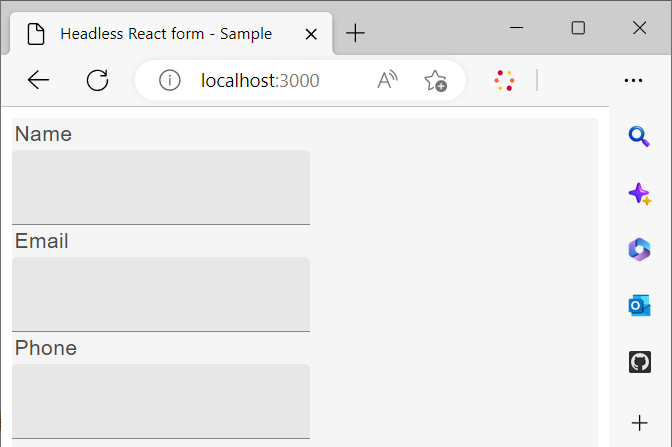

# 使用自定义react库呈现Headless表单

您可以创建并实施自定义组件，以根据组织的要求和准则自定义Headless自适应表单的外观和功能（行为）。

这些组件有两个主要用途：控制表单字段的外观或样式，以及在表单模型实例中存储通过这些字段收集的数据。 如果这听起来令人困惑，请不要担心 — 我们稍后将更详细地探讨这些目的。 现在，我们侧重于创建自定义组件、使用这些组件呈现表单以及使用事件保存数据并将其提交到REST端点的初始步骤。

本教程中使用Google材料UI组件来演示如何使用自定义React组件渲染Headless自适应表单。 但是，您不仅限于使用此库，还可以自由使用任何React组件库或开发您自己的自定义组件。

根据本文的结论，在[使用入门工具包](create-and-publish-a-headless-form.md)创建和发布Headless表单中创建的&#x200B;_联系我们_&#x200B;表单将转换为以下内容：


使用Google材料UI组件呈现表单涉及的主要步骤包括：


## 1.安装Google材料UI

默认情况下，入门套件使用[Adobe的Spectrum](https://spectrum.adobe.com/)组件。 让我们将其设置为使用[Google的材料UI](https://mui.com/)：

1. 确保入门套件未运行。 要停止入门工具包，请打开您的终端，导航到&#x200B;**react-starter-kit-aem-headless-forms**，然后按Ctrl-C(在Windows、Mac和Linux上相同)。

   请勿尝试关闭终端。 关闭终端不会停止入门套件。

1. 运行以下命令：

```shell
    
    npm install @mui/material @emotion/react @emotion/styled --force
    
```

它会安装Google材料UI npm库，并将库添加到入门套件依赖项。 您现在可以使用材质UI组件来呈现表单组件。


## 2.创建自定义React组件

让我们创建一个自定义组件，该组件将默认[文本输入](https://spectrum.adobe.com/page/text-field/)组件替换为[Google素材UI文本字段](https://mui.com/material-ui/react-text-field/)组件。

在Headless表单定义中使用的每个组件类型（[fieldType](https://opensource.adobe.com/aem-forms-af-runtime/storybook/?path=/story/reference-json-properties-fieldtype--text-input)或：type）都需要单独的组件。 例如，在您在上一节创建的“联系我们”表单中，类型为`text-input` ([fieldType： &quot;text-input&quot;](https://opensource.adobe.com/aem-forms-af-runtime/storybook/?path=/docs/adaptive-form-components-text-input-field--def))的“名称”、“电子邮件”和“电话”字段的类型为`multiline-input` ([&quot;fieldType&quot;： &quot;multiline-input&quot;](https://opensource.adobe.com/aem-forms-af-runtime/storybook/?path=/docs/reference-json-properties-fieldtype--multiline-input))。


让我们创建一个自定义组件以覆盖使用[fieldType： &quot;text-input&quot;](https://opensource.adobe.com/aem-forms-af-runtime/storybook/?path=/docs/adaptive-form-components-text-input-field--def)属性和[材料UI文本字段](https://mui.com/material-ui/react-text-field/)组件的所有表单字段。


要创建自定义组件并使用[fieldType](https://opensource.adobe.com/aem-forms-af-runtime/storybook/?path=/docs/adaptive-form-components-text-input-field--def)属性映射自定义组件：

1. 在代码编辑器中打开&#x200B;**react-starter-kit-aem-headless-forms**&#x200B;目录并导航到`\react-starter-kit-aem-headless-forms\src\components`。


1. 创建&#x200B;**滑块**&#x200B;或&#x200B;**富文本**&#x200B;文件夹的副本，并将复制的文件夹重命名为&#x200B;**materialtextfield**。 滑块和富文本是入门应用程序中可用的两个示例自定义组件。 您可以使用这些组件创建自己的自定义组件。

   

1. 打开`\react-starter-kit-aem-headless-forms\src\components\materialtextfield\index.tsx`文件并使用以下代码替换现有代码。 此代码返回并呈现[Google材料UI文本字段](https://mui.com/material-ui/react-text-field/)组件。

```JavaScript
 
     import React from 'react';
     import {useRuleEngine} from '@aemforms/af-react-renderer';
     import {FieldJson, State} from '@aemforms/af-core';
     import { TextField } from '@mui/material';
     import Box from '@mui/material/Box';
     import { richTextString } from '@aemforms/af-react-components';
     import Typography from '@mui/material/Typography';


     const MaterialtextField = function (props: State<FieldJson>) {

         const [state, handlers] = useRuleEngine(props);

         return(

         <Box>
             <Typography component="legend">{state.visible ? richTextString(state?.label?.value): ""} </Typography>
             <TextField variant="filled"/>
         </Box>

         )
     }

     export default MaterialtextField;
```


`state.visible`部分检查组件是否设置为可见。 如果是，则使用`richTextString(state?.label?.value)`检索并显示字段的标签。


您的自定义组件`materialtextfield`已就绪。 让我们将此自定义组件设置为使用Google材料UI文本字段替换[fieldType： &quot;text-input&quot;](https://opensource.adobe.com/aem-forms-af-runtime/storybook/?path=/docs/adaptive-form-components-text-input-field--def)的所有实例。

## 3.映射具有Headless表单字段的自定义组件

使用第三方库组件呈现表单字段的过程称为映射。 将每个([fieldType](https://opensource.adobe.com/aem-forms-af-runtime/storybook/?path=/story/reference-json-properties-fieldtype--text-input))映射到第三方库的相应组件。

所有与映射相关的信息都已添加到`mappings.ts`文件中。 `mappings.ts`文件中的`...mappings`语句引用默认映射，该映射使用[Adobe频谱](https://spectrum.adobe.com/page/text-field/)组件覆盖（[fieldType](https://opensource.adobe.com/aem-forms-af-runtime/storybook/?path=/story/reference-json-properties-fieldtype--text-input)或：type）。

要为`materialtextfield`组件添加在上一步中创建的映射，请执行以下操作：

1. 打开`mappings.ts`文件。

1. 添加以下import语句以将`materialtextfield`组件包含到`mappings.ts`文件中：


   ```JavaScript
       import MaterialtextField from "../components/materialtextfield";
   ```

1. 添加以下语句以使用materialtextfield组件映射`text-input`。


   ```JavaScript
       "text-input": MaterialtextField
   ```

   文件的最终代码如下所示：

   ```JavaScript
         import { mappings } from "@aemforms/af-react-components";
         import MaterialtextField from "../components/materialtextfield";
   
   
         const customMappings: any = {
           ...mappings,
           "text-input": MaterialtextField
        };
        export default customMappings;
   ```

1. 保存并运行应用程序。 表单的前三个字段使用[Google材料UI文本字段](https://mui.com/material-ui/react-text-field/)呈现：

   


   同样，您可以为消息(“fieldType”：“multiline-input”)创建自定义组件，并对服务(“fieldType”：“number-input”)字段进行评级。 您可以为消息的自定义组件克隆以下Git存储库，并对服务字段评级：

   [https://github.com/singhkh/react-starter-kit-aem-headless-forms](https://github.com/singhkh/react-starter-kit-aem-headless-forms)

## 下一步

您已成功使用使用Google材料UI的自定义组件呈现表单。 是否尝试通过单击提交按钮(映射到相应的Google材料UI组件)来提交表单？ 如果没有，请试一试。

表单是否将数据提交到任何数据源？ 不行吗？ 别担心。 这是因为您的表单未配置为与运行时库通信。

如何配置表单以与其通信？ 我们即将发表一篇文章，详细解释所有内容。 敬请关注！
